autoscale: true
theme: Franziska, 9

#Advances in Probabilistic Programming with Python

#### 2017 Danish Bioinformatics Conference


**Christopher Fonnesbeck**
*Department of Biostatistics*  
*Vanderbilt University Medical Center*

---

# **Probabilistic Programming**


^
PP is not new; the term is
A probabilistic program (PP) is any program that is partially dependent on random numbers
- outputs are not deterministic
- Can be expressed in any language that can describe probability models i.e. has a random number generator

---

# Stochastic language "primitives"

Distribution over values:

```python
X ~ Normal(μ, σ)
x = X.random(n=100)
```

Distribution over functions:

```python
Y ~ GaussianProcess(mean_func(x), cov_func(x))
y = Y.predict(x2)
```

Conditioning:

```python
p ~ Beta(1, 1)
z ~ Bernoulli(p) # z|p
```

^ 
- building blocks are variables with stochastic properties
- ability to draw random values from a particular distribution
- allows for **conditioning** between variables
- allows probability models to be specified at high level

---

# **Bayesian Inference**

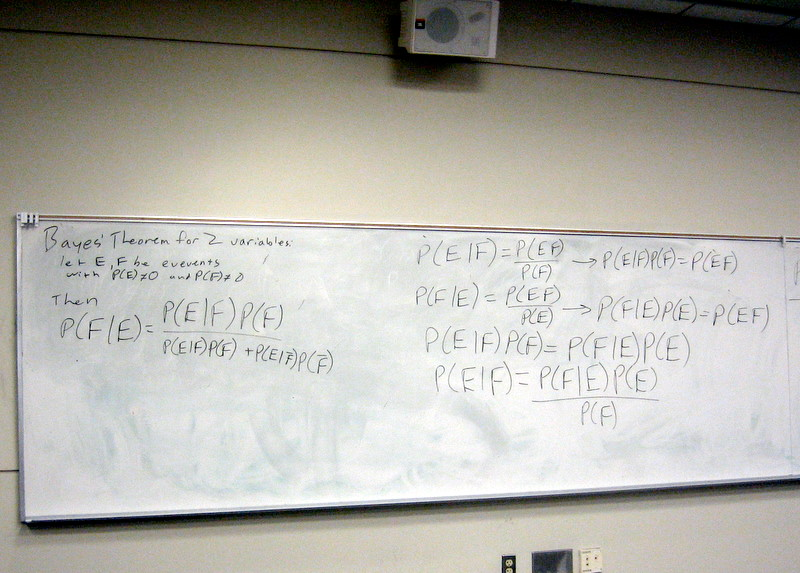

^
PP facilitates the application of Bayes
- Bayes interprets probabilities differently than classical statistics

---

# Inverse Probability

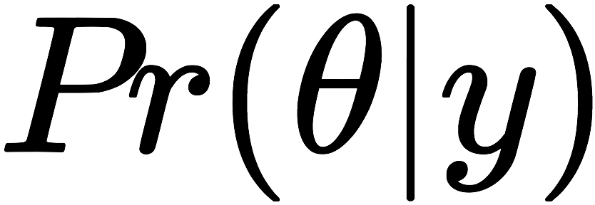

^ 
- effects to causes (backwards)
- effects are what we observe; we can use these quantities in **conditioning statements** to help determine what the causes might be
- estimate the unknown quantities that we care about (and the nuisance parameters we don’t care about)


---

# Why Bayes?

> The Bayesian approach is attractive because it is **useful**. Its usefulness derives in large measure from its *simplicity*. Its simplicity allows the investigation of **far more complex models** than can be handled by the tools in the classical toolbox.
> -- *Link and Barker 2010*

---


^
Probability distributions are used to characterize what we know and don’t know about unknown quantities of interest
- Bayes formula is a rule for learning from data (the goal of machine learning)

---

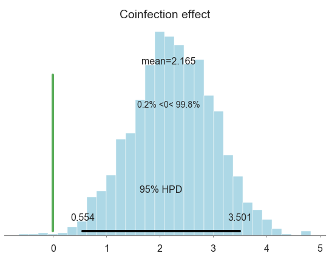

^
outputs from probabilistic programs will always be in probabilistic terms, and therefore provide a measure of uncertainty associated with estimates

---

# Probabilistic Programming

## **in three easy steps**

---

# Encode a 
# [fit] Probability Model[^⚐]

# [fit] **1**

[^⚐]: in Python

---

# Stochastic program

Joint distribution of latent variables and data

## $$Pr(\theta, y) = Pr(y| \theta) Pr(\theta)$$


---

# Prior distribution

*Quantifies the uncertainty in latent variables*

$$\theta \sim \text{Normal}(0, 1)$$

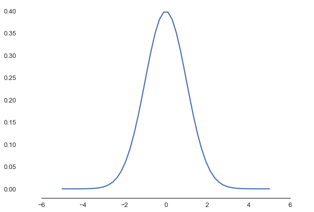

---

# Prior distribution

*Quantifies the uncertainty in latent variables*

$$\theta \sim \text{Normal}(0, 100)$$

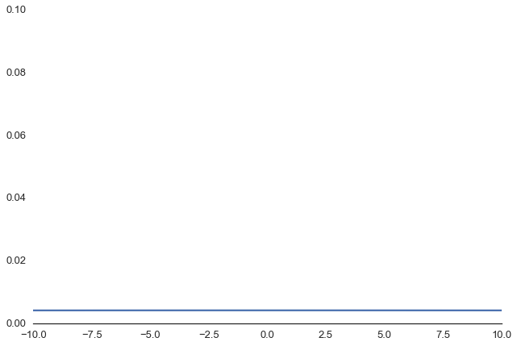

---

# Prior distribution

*Quantifies the uncertainty in latent variables*

$$\theta \sim \text{Beta}(1, 50)$$

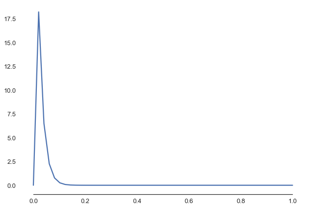

^
rare disease prevalence

---

# $$\theta \sim \text{Lognormal}(-1.2, 0.4)$$

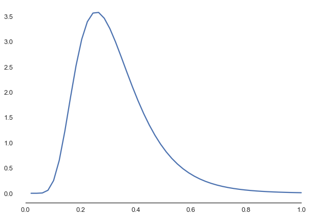
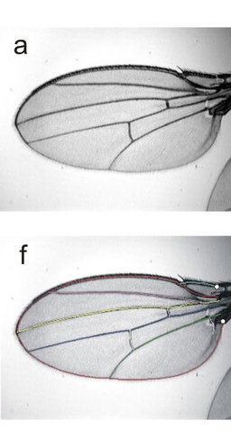

<!-- 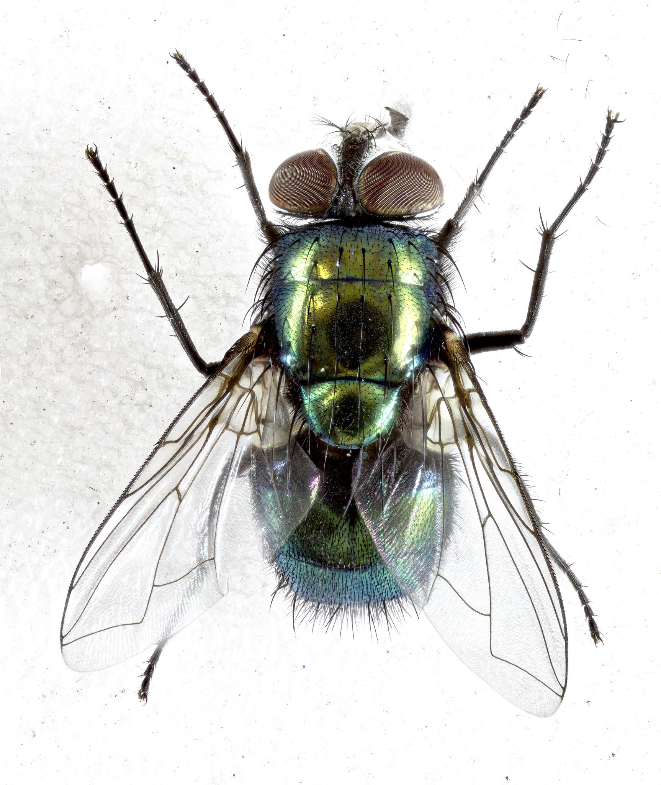 -->

---


---

# $$\theta \sim \text{Normal}(0.261, 0.034)$$


---

# Likelihood function

Conditions our model on the observed data

# $$Pr(y|\theta)$$


^ 
Data generating mechanism

---

# Likelihood function

Conditions our model on the observed data

# $$x \sim \text{Normal}(\mu, \sigma^2)$$

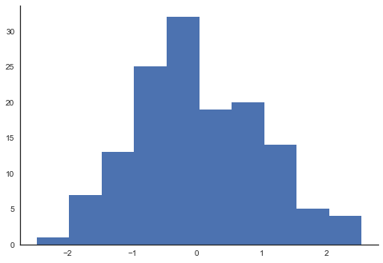

^ 
Data generating mechanism

---

# $$x_{hits} \sim \text{Binomial}(n_{AB}, p_{hit})$$

Models the distribution of $$x$$ hits observed from $$n$$ at-bats.

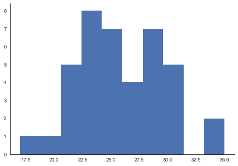


---

# $$x_{cases} \sim \text{Poisson}(\mu)$$

Counts per unit time

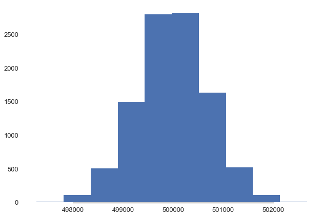

---

# [fit] Infer Values 
## for latent variables

# [fit] **2**

---

# Posterior distribution

## $$Pr(\theta | y) \propto Pr(y|\theta) Pr(\theta)$$

^
Prior updated with likelihood to yield posterior
- formal approach for learning from data

---

# Posterior distribution

## $$Pr(\theta | y) = \frac{Pr(y|\theta) Pr(\theta)}{Pr(y)}$$

^
Must normalize to obtain probability density
- marginal likelihood or evidence

---

# Posterior distribution

## $$Pr(\theta | y) = \frac{Pr(y|\theta) Pr(\theta)}{\int_{\theta} Pr(y|\theta) Pr(\theta) d\theta}$$

^
Requires **numerical methods** 

---

## Probabilistic programming **abstracts** the inference procedure


---

# [fit] Check your Model

# [fit] **3**

^
- Model outputs are conditional on the model specification. 
- Models are specified based on assumptions that are largely unverifiable

---

### Model checking


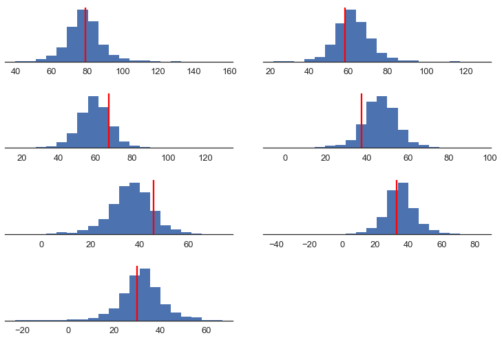

^
- compare simulated data to observed data

---

## [fit] WinBUGS

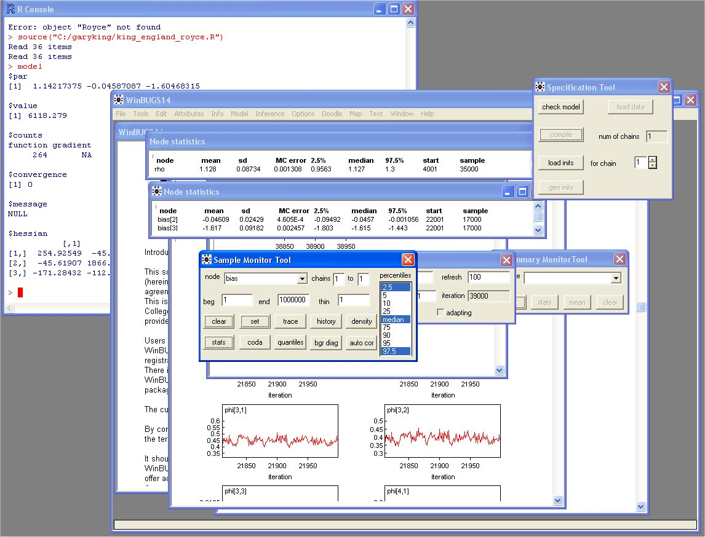

^
Statisticians have been doing PP since 1990s
- released in 1997 by Cambridge Biostatistics and Imperial College

---


^
Bayes for the masses
- made it easy to describe and share Bayesian models

---

```r
model {
     for (j in 1:J){
       y[j] ~ dnorm (theta[j], tau.y[j])
       theta[j] ~ dnorm (mu.theta, tau.theta)
       tau.y[j] <- pow(sigma.y[j], -2)
     }
     mu.theta ~ dnorm (0.0, 1.0E-6)
     tau.theta <- pow(sigma.theta, -2)
     sigma.theta ~ dunif (0, 1000)
   }

```

^
Allowed models to be specified using R-like syntax
- closed source
- object Pascal
- DSL

---

# [fit] PyMC3

- started in 2003
- PP framework for fitting arbitrary probability models
- based on Theano
- implements "next generation" Bayesian inference methods
- NumFOCUS sponsored project

### `github.com/pymc-devs/pymc3`


#### Salvatier, Wiecki and Fonnesbeck (2016)

^ 
Will describe gradient-based methods later

---

# Calculating Gradients in Theano

```python
>>> from theano import function, tensor as tt
```

^ 
- specifying and evaluating mathematical expressions using **tensors**
- toolkit for deep learning: similar to TensorFlow, Torch
- Yoshua Bengio's LISA lab (now Montreal Institute for Learning Algorithms)
- dynamic C code generation 

---

# Calculating Gradients in Theano

```python
>>> from theano import function, tensor as tt
>>> x = tt.dmatrix('x')

```

---

# Calculating Gradients in Theano

```python
>>> from theano import function, tensor as tt
>>> x = tt.dmatrix('x')
>>> s = tt.sum(1 / (1 + tt.exp(-x)))

```

---

# Calculating Gradients in Theano

```python
>>> from theano import function, tensor as tt
>>> x = tt.dmatrix('x')
>>> s = tt.sum(1 / (1 + tt.exp(-x)))
>>> gs = tt.grad(s, x)

```

---

# Calculating Gradients in Theano

```python
>>> from theano import function, tensor as tt
>>> x = tt.dmatrix('x')
>>> s = tt.sum(1 / (1 + tt.exp(-x)))
>>> gs = tt.grad(s, x)
>>> dlogistic = function([x], gs)

```

---

# Theano graph

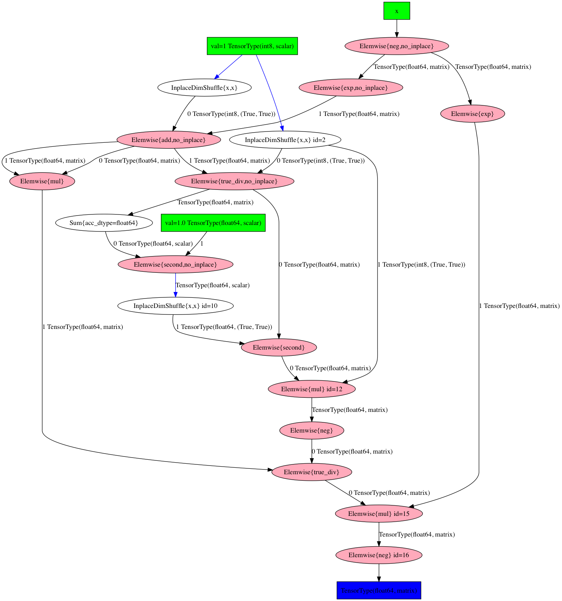

```python
>>> from theano import function, tensor as tt
>>> x = tt.dmatrix('x')
>>> s = tt.sum(1 / (1 + tt.exp(-x)))
>>> gs = tt.grad(s, x)
>>> dlogistic = function([x], gs)

```

---

# Calculating Gradients in Theano

```python
>>> from theano import function, tensor as tt
>>> x = tt.dmatrix('x')
>>> s = tt.sum(1 / (1 + tt.exp(-x)))
>>> gs = tt.grad(s, x)
>>> dlogistic = function([x], gs)
>>> dlogistic([[3, -1],[0, 2]])
array([[ 0.04517666,  0.19661193],
       [ 0.25      ,  0.10499359]])
```

^
- efficient automatic, symbolic differentiation

---

# Example: Radon exposure[^✴︎]


[^✴︎]: Gelman et al. (2013) *Bayesian Data Analysis*

^
motivate with real example
-  radioactive, colorless, odorless, tasteless noble gas
-  primary non-smoking cause of lung cancer

---


^
houses with basements thought to be more susceptible to contamination

---

# Unpooled model

Model radon in each county independently.

$$y_{i} = \alpha_{j[i]} + \beta x_{i} + \epsilon_{i}$$

$$\epsilon_{i} \sim N(0, \sigma)$$

where $$j = 1,\ldots,85$$ (counties)

^
- simple model: assuming baseline radon levels different among counties, but basement effect the same
- errors represent measurement error, temporal within-house variation, or variation among houses.  

---

# Priors

```python   
with Model() as unpooled_model:
    
    α = Normal('α', 0, sd=1e5, shape=counties)
    β = Normal('β', 0, sd=1e5)
    σ = HalfCauchy('σ', 5)
```

^
- use context manager to add variables automatically to our model
- Stochastic nodes
- unicode in Python3!

---

```python
>>> type(β)
pymc3.model.FreeRV
```

^
PP primitive types

---

```python
>>> type(β)
pymc3.model.FreeRV
>>> β.distribution.logp(-2.1).eval()
array(-12.4318639983954)
```

^
- theano tensor evaluated lazily

---

```python
>>> type(β)
pymc3.model.FreeRV
>>> β.distribution.logp(-2.1).eval()
array(-12.4318639983954)
>>> β.random(size=4)
array([ -10292.91760326,   22368.53416626, 
         124851.2516102,   44143.62513182]])
```

---

# Transformed variables

```python
with unpooled_model:
    
    θ = α[county] + β*floor
```

^
Deterministic

---

# Likelihood

```python
with unpooled_model:
    
    y = Normal('y', θ, sd=σ, observed=log_radon)
```

---

# Model graph

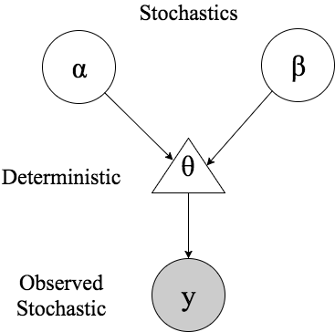

---

# **Calculating Posteriors**

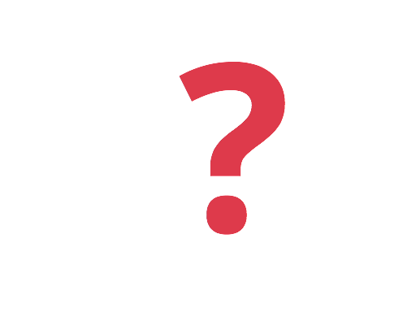

## [fit] $$Pr(\theta | y) \propto Pr(y|\theta) Pr(\theta)$$

^
Obstacle!  
- calculating posterior distributions is analytically impossible
- calculating them numerically is challenging: 87 parameters in this model!

---

# Bayesian approximation

- Maximum *a posteriori* (MAP) estimate
- Laplace (normal) approximation
- Rejection sampling
- Importance sampling
- Sampling importance resampling (SIR)
- Approximate Bayesian Computing (ABC)

^
Variety of ways, adequacy depends on model and objectives

---

# MCMC

Markov chain Monte Carlo simulates a **Markov chain** for which some function of interest is the **unique, invariant, limiting** distribution.

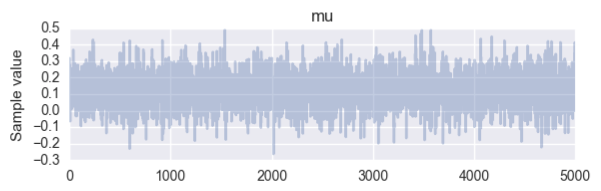

^
**dependent** samples

---

# MCMC

Markov chain Monte Carlo simulates a **Markov chain** for which some function of interest is the **unique, invariant, limiting** distribution.

This is guaranteed when the Markov chain is constructed that satisfies the **detailed balance equation**:

$$\pi(x)Pr(y|x) = \pi(y) Pr(x|y)$$


---

### Metropolis sampling


---

### Metropolis sampling[^**]


[^**]: 2000 iterations, 1000 tuning

^
- workhorse algorithm
- performs poorly for larger models
- convergence issues
- requires tens/hundreds of thousands of iterations
- optimal acceptance rate is 24%

---

# Hamiltonian Monte Carlo

Uses a *physical analogy* of a frictionless particle moving on a hyper-surface

Requires an *auxiliary variable* to be specified

- position (unknown variable value)
- momentum (auxiliary)

$$\mathcal{H}(s, \phi) = E(s) + K(\phi) = E(s) + \frac{1}{2}(\sum_i)\phi_i^2$$

^
Takes advantage of model gradient information to improve proposals
- emulates Hamitonian dynamics on a Euclidean manifold
- sum of potential and kinetic energy
- no more random walk!

---

## Hamiltonian Dynamics

$$\frac{ds_i}{dt} = \frac{\partial \mathcal{H}}{\partial \phi_i} = \phi_i$$
$$\frac{d\phi_i}{dt} = - \frac{\partial \mathcal{H}}{\partial s_i} = - \frac{\partial E}{\partial s_i}$$

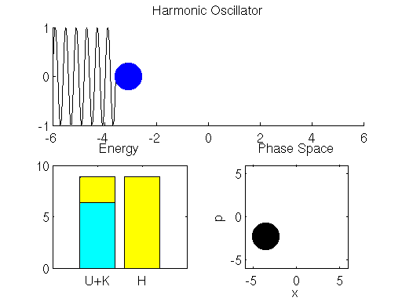

^ 
This transformation preserves volume and is reversible. 
The chain by itself is not ergodic , since simulating the dynamics maintains a
fixed Hamiltonian $\mathcal{H}(s,\phi)$. HMC thus alternates Hamiltonian
dynamic steps, with Gibbs sampling of the velocity.


---

# Hamiltonian MC

1.  Sample a **new velocity** from univariate Gaussian
2.  Perform `n` **leapfrog steps** to obtain new state $$\theta^{\prime}$$
3.  Perform **accept/reject** move of $$\theta^{\prime}$$


^
- leapfrog steps discretize the continuous Hamiltonian dynamics

---

# Hamiltonian MC[^**]


---

# No U-Turn Sampler (NUTS)

*Hoffmann and Gelman (2014)*


^
- Extension of HMC that adaptively selects path lengths
- also sets leapfrog step size (epsilon)

---


---

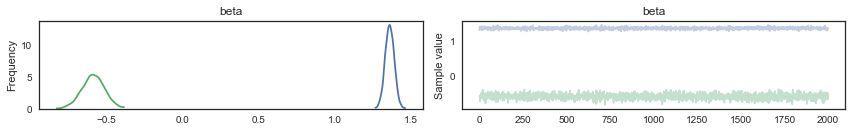

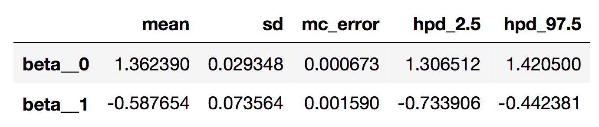

---

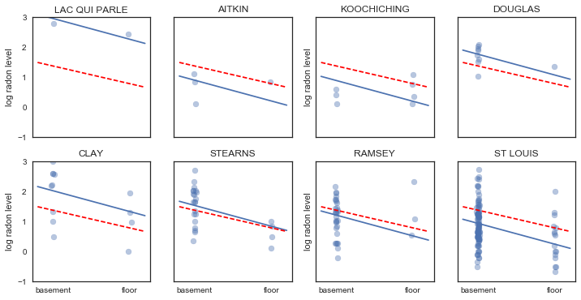

^
- model overfits counties with sparse data
- neither of these models are satisfactory:
- if we are trying to identify high-radon counties, pooling is useless
- we do not trust extreme unpooled estimates produced by models using few observations

---

# Non-hierarchical models

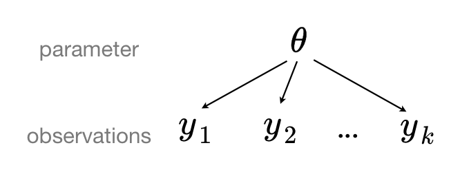


---

# Hierarchical model


---

# Partial pooling model

```python
with Model() as partial_pooling:
    
    # Priors
    mu_a = Normal('mu_a', mu=0., sd=1e5)
    sigma_a = HalfCauchy('sigma_a', 5)
    
    # Random intercepts
    a = Normal('a', mu=mu_a, sd=sigma_a, shape=counties)
    
    # Model error
    sigma_y = HalfCauchy('sigma_y',5)
    
    # Expected value
    y_hat = a[county]
    
    # Data likelihood
    y_like = Normal('y_like', mu=y_hat, sd=sigma_y, observed=log_radon)
```

---


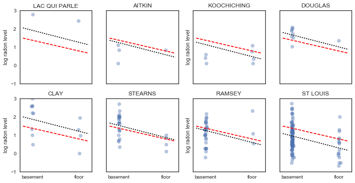

^
- Accounting for natural hierarchical structure of observational data
- Estimation of coefficients for (under-represented) groups
- Incorporating individual- and group-level information when estimating group-level coefficients
- Allowing for variation among individual-level coefficients across groups

---

# Variational Inference

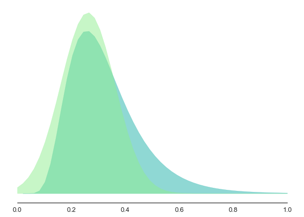

^
- even with more sophisticated algorithms, MCMC can be **slow**
- approximate unkown posterior with a simple, known distribution
- transform and select values of its parameters that make it as similar as possible to posterior

---

# Variational Inference

Variational inference minimizes the **Kullback-Leibler divergence**

$$\begin{eqnarray}
\mathbb{KL}(q(\theta) \parallel p(\theta\ |\ \mathcal{y})) &=& \int q(\theta, \phi) \frac{q(\theta, \phi)}{p(\theta| y)} d\theta \\
&\Rightarrow& \mathbb{E}_q\left(\log\left(\frac{q(\theta)}{p(\theta\ |\ \mathcal{y})}\right)\right) \\
\end{eqnarray}$$

from approximate distributions, but we can't calculate the true posterior distribution.

^ 
Changes problem from MC sampling problem to **optimization** problem
- but, KL includes the posterior in its formulation; can't optimize directly

---

# Evidence Lower Bound 
(ELBO)


$$
\mathbb{KL}(\color{purple}{q(\theta)} \parallel \color{red}{p(\theta\ |\ \mathcal{D})}) = -(\underbrace{\mathbb{E}_q(\log \color{blue}{p(\mathcal{D}, \theta))} - \mathbb{E}_q(\color{purple}{\log q(\theta)})}_{\color{orange}{\textrm{ELBO}}}) + \log \color{green}{p(\mathcal{D})}
$$

^ 
Minimizing the Kullback-Leibler divergence is equivalent to maximizing the evidence lower bound
This only requires the joint distribution (which is just likelihood times prior)
BUT:
- q selection
- support-matching constraint

---

# ADVI[^*]

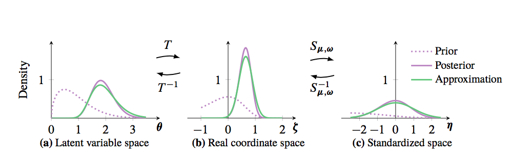

[^*]: Kucukelbir, A., Tran, D., Ranganath, R., Gelman, A., & Blei, D. M. (2016, March 2). Automatic Differentiation Variational Inference. arXiv.org.

---

### Maximizing the ELBO

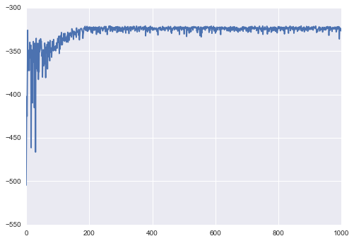

---

#### Estimating `Beta(147, 255)` posterior

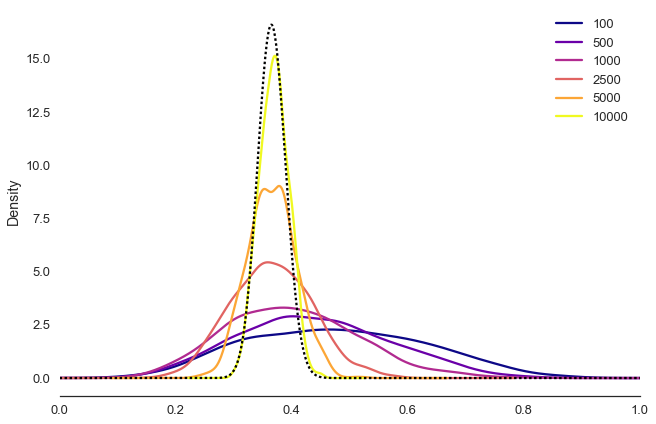

---

```python
with partial_pooling:
    
    approx = fit(n=100000)
```

```
Average Loss = 1,115.5: 100%|██████████| 100000/100000 [00:13<00:00, 7690.51it/s]
Finished [100%]: Average Loss = 1,115.5
```

---

```python
with partial_pooling:
    
    approx = fit(n=100000)
```

```
Average Loss = 1,115.5: 100%|██████████| 100000/100000 [00:13<00:00, 7690.51it/s]
Finished [100%]: Average Loss = 1,115.5
```

```python
>>> approx
```

```
<pymc3.variational.approximations.MeanField at 0x119aa7c18>
```

---

```python
with partial_pooling:
    
    approx_sample = approx.sample(1000)
    
traceplot(approx_sample, varnames=['mu_a', 'σ_a'])
```

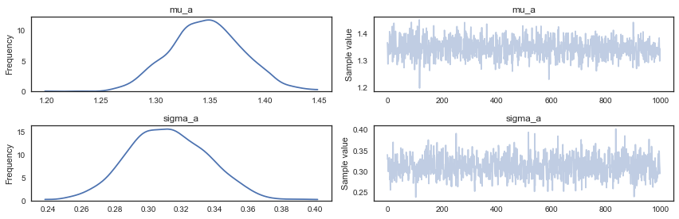

---

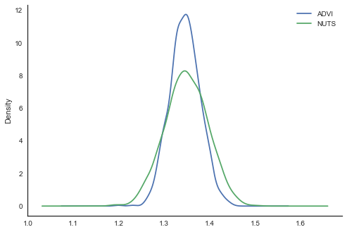

---

## Normalizing flows[^@]

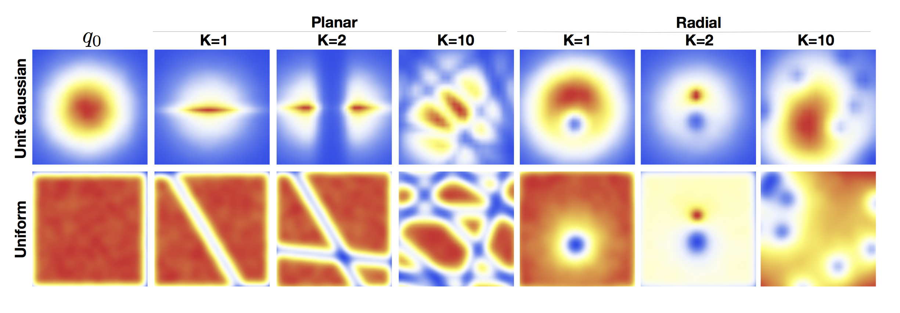

[^@]: Rezende & Mohamed 2016

^
Gaussian and uniform approximating distributions, planar and radial transformations

---

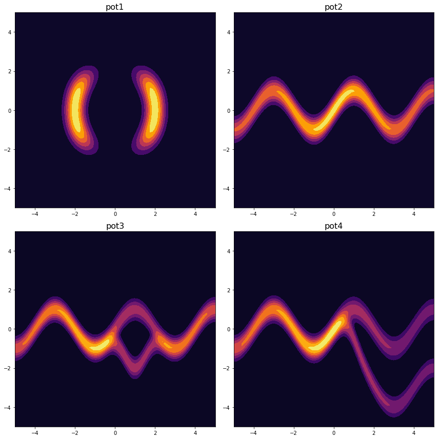

---

```python
with my_model:
    nf = NFVI('planar*16', jitter=1.)
    
nf.fit(25000, obj_optimizer=pm.adam(learning_rate=0.01))
trace = nf.approx.sample(5000)
```

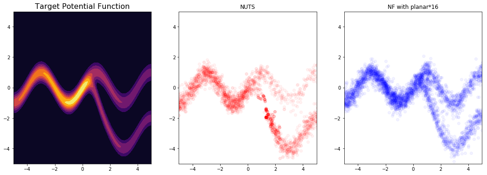

---

# Minibatch ADVI

```python
minibatch_x = pm.Minibatch(X_train, batch_size=50)
minibatch_y = pm.Minibatch(Y_train, batch_size=50)
model = construct_model(minibatch_x, minibatch_y)

with model:
    approx = pm.fit(40000)
```

^
- training models on all data doesn't scale well. 
- training on mini-batches of data (stochastic gradient descent) avoids local minima and can lead to faster convergence

---

# **Gaussian processes**

A latent, non-linear function $$f(x)$$ is modeled as being multivariate normally distributed (a Gaussian Process):

$$f(x) \sim \mathcal{GP}(m(x), \, k(x, x'))$$

- mean function, $$m(x)$$ 
- covariance function, $$k(x, x')$$ 

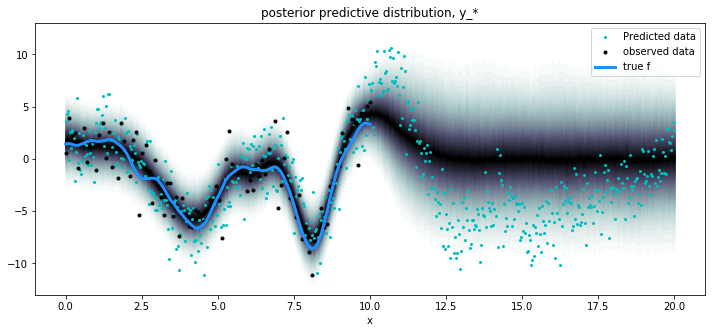

^
Gaussian Process regression is a non-parametric approach to regression or data fitting that assumes that observed data points are generated by some unknown latent function
- distribution over functions
- infinitely-parametric MVN

---

# Quadratic

### $$k(x, x') = \mathrm{exp}\left[ -\frac{(x - x')^2}{2 \ell^2} \right]$$

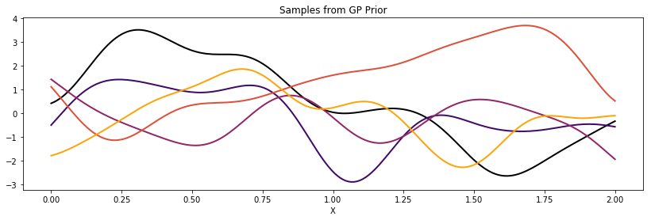

---

# Matern(3/2)

### $$k(x, x') = \left(1 + \frac{\sqrt{3(x - x')^2}}{\ell}\right)\mathrm{exp}\left[ - \frac{\sqrt{3(x - x')^2}}{\ell} \right]$$

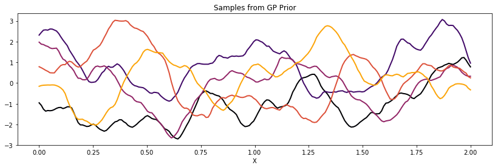

---

# Cosine

### $$k(x, x') = \mathrm{cos}\left( \frac{||x - x'||}{ \ell^2} \right)$$

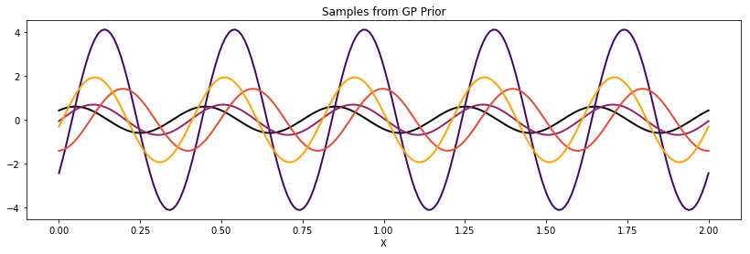

---

# Gibbs

### $$k(x, x') = \sqrt{\frac{2\ell(x)\ell(x')}{\ell^2(x) + \ell^2(x')}} \mathrm{exp}\left[ -\frac{(x - x')^2}{\ell^2(x) + \ell^2(x')} \right]$$

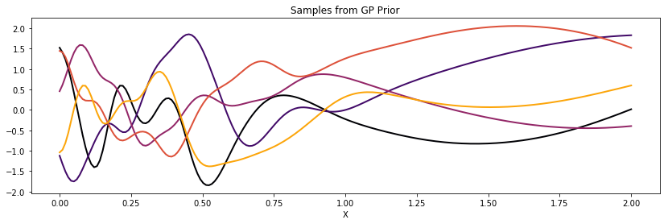


---

# Marginal GP


```python
with pm.Model() as model:
    ℓ = pm.Gamma("ℓ", alpha=2, beta=1)
    η = pm.HalfCauchy("η", beta=5)
    
    cov = η**2 * pm.gp.cov.Matern52(1, ℓ)
    gp = pm.gp.Marginal(cov_func=cov)
     
    σ = pm.HalfCauchy("σ", beta=5)
    y_ = gp.marginal_likelihood("y", n_points=n, X=X, y=y, noise=σ)
```

---

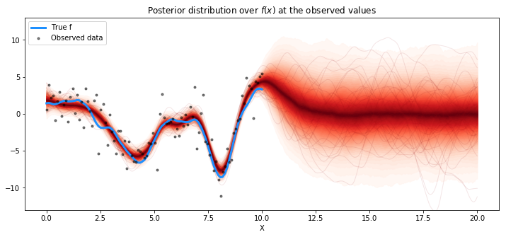

---

# Posterior predictive samples

```python

n_new = 600
X_new = np.linspace(0, 20, n_new)[:,None]

with model:
    f_pred = gp.conditional("f_pred", n_new, X_new)
    pred_samples = pm.sample_ppc([mp], vars=[f_pred], samples=2000)
```

^
- new values from x=0 to x=20
- add the GP conditional to the model, given the new X values

---


---

### Example: Psychosocial Determinants of Weight

- Modeling patient BMI trajectories with GP
- Clustering using dynamic time warping
- Covariate model to predict cluster membership

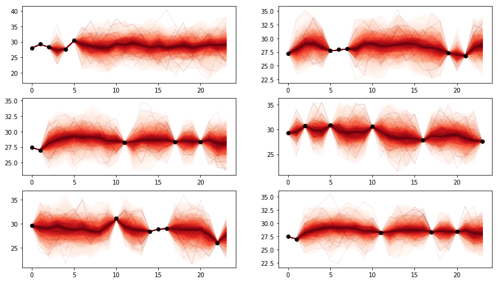 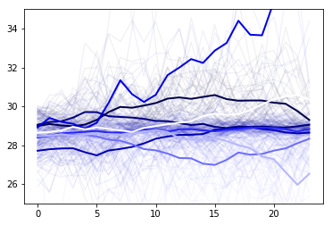

---

# **Bayesian Machine Learning**

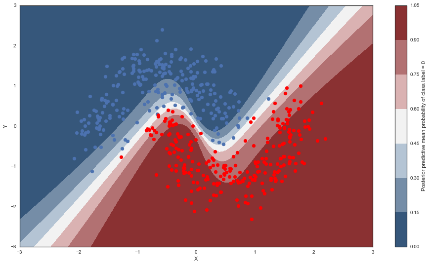

^
Machine learning models are:
	- data hungry
	- poor at representing uncertainthy
	- hard to estimate 
	- easy to fool
	- hard to interpret

---

## Convolutional variational autoencoder[^+]


[^+]: Photo: K. Frans

---

## Convolutional variational autoencoder[^♌︎]

```python
import keras

class Decoder:
    
    ...
        
    def decode(self, zs):

        keras.backend.theano_backend._LEARNING_PHASE.set_value(np.uint8(0))

        return self._get_dec_func()(zs)
```

[^♌︎]: Taku Yoshioka (c) 2016

^
- Keras is a high-level neural networks API, written in Python and capable of running on top of TensorFlow, Microsoft Cognitive Toolkit (CNTK), or Theano.
- we define a probabilistic model, which combines the encoder and decoder.  
- parameter objects are obtained as shared variables of Theano.

---

```python
with pm.Model() as model:
    # Hidden variables
    zs = pm.Normal('zs', mu=0, sd=1, 
    			shape=(minibatch_size, dim_hidden), 
    			dtype='float32')

    # Decoder and its parameters
    dec = Decoder(zs, net=cnn_dec)
    
    # Observation model
    xs_ = pm.Normal('xs_', mu=dec.out.ravel(), sd=0.1, 
                observed=xs_t.ravel(), dtype='float32')
```

^
Probabilistic model involves only two random variables; 
- latent variable zs 
- observation x.  
  We put a Normal prior on z, decode variational parameters of z|x and define the likelihood of the observations x.
- cnn_dec is conv. NN from Keras  

---

```python
x_minibatch = pm.Minibatch(data, minibatch_size)

with model:
    approx = pm.fit(
        15000,
        local_rv=local_RVs,
        more_obj_params=enc.params + dec.params, 
        obj_optimizer=pm.rmsprop(learning_rate=0.001),
        more_replacements={xs_t:x_minibatch},
    )
```

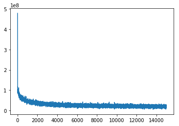

---

## Bayesian Deep Learning in PyMC3[^✧]

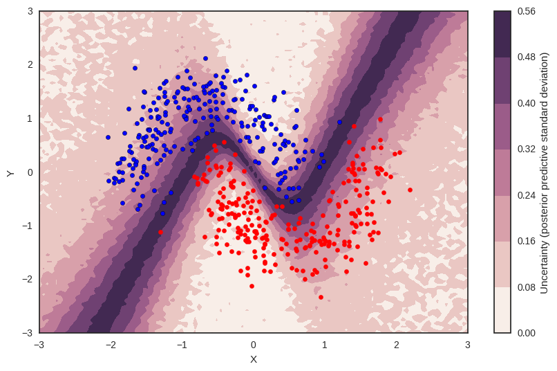

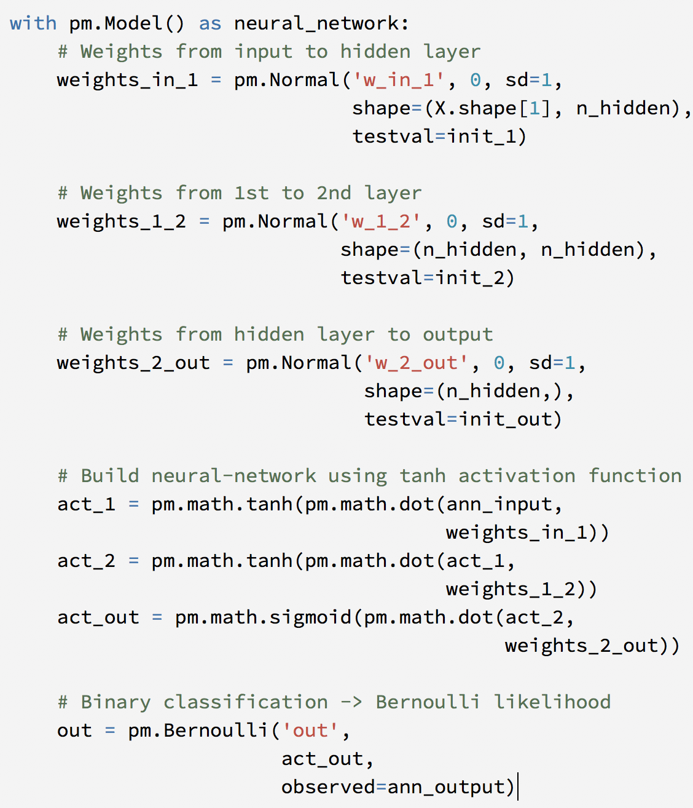

[^✧]: Thomas Wiecki 2016

^
Plot of posterior predictive standard deviation


---

# The Future

* Discontinuous HMC
* Riemannian Manifold HMC
* Stochastic Gradient Fisher Scoring
* ODE solvers


^
- Riemannian manifold replaces Euclidean
- 3 GSoC students!

---

# Jupyter Notebook Gallery


`bit.ly/pymc3nb`

---

## Other Probabilistic Programming Tools[^⚐]

- Edward
- GPy/GPFlow
- PyStan
- emcee
- BayesPy


---

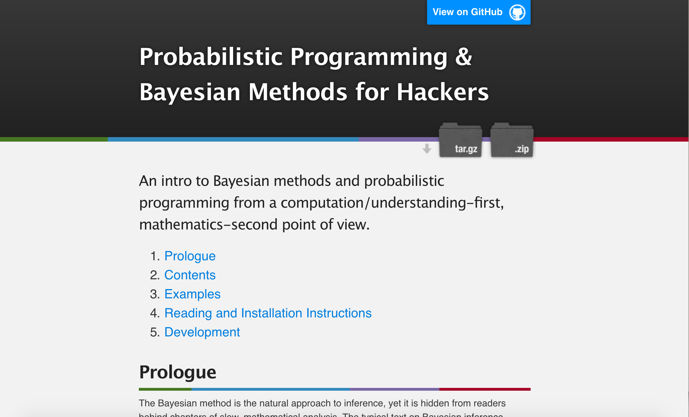


^
- Original content created by Cam Davidson-Pilon
- ported to Python 3 and PyMC3 by Max Margenot and Thomas Wiecki

---

# The PyMC3 Team

- Colin Carroll
- Peadar Coyle
- Bill Engels
- Maxim Kochurov
- Junpeng Lao
- Osvaldo Martin
- Kyle Meyer
- Austin Rochford
- John Salvatier
- Adrian Seyboldt
- Hannes Vasyura-Bathke
- Thomas Wiecki
- Taku Yoshioka

^
Worth spending time to produce good software and support it. 


